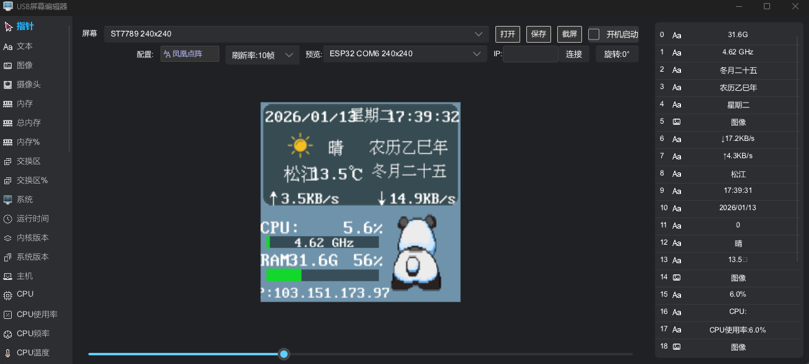
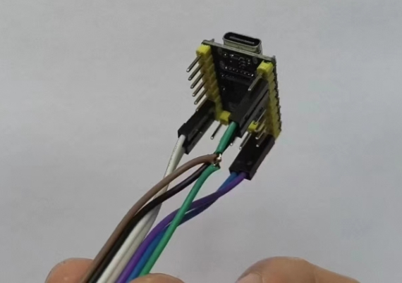
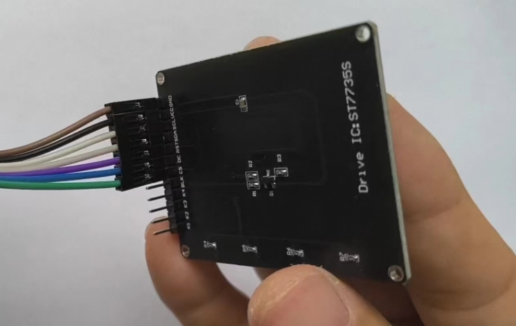
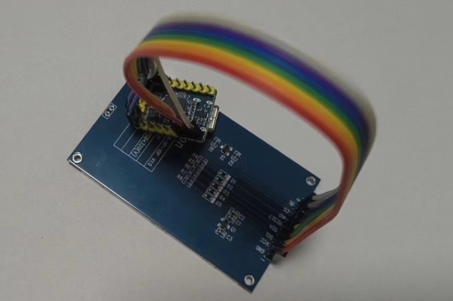

# USB Screen
 USB屏幕&编辑器

 

# 图文教程:

# [https://zhuanlan.zhihu.com/p/698789562](https://zhuanlan.zhihu.com/p/698789562)

# 视频教程
# [https://www.bilibili.com/video/BV1eTTwe6EFU/?vd_source=a2700de3db7bd5f0117df32bdd5cef9f](https://www.bilibili.com/video/BV1eTTwe6EFU/?vd_source=a2700de3db7bd5f0117df32bdd5cef9f)

# 硬件

本项目支持两种硬件方案：

| 方案 | 主控芯片 | 连接方式 | 支持屏幕型号 | 特点 |
|------|---------|---------|-------------|------|
| **RP2040** | RP2040 | USB | ST7735、ST7789 (2种) | 成本低、稳定 |
| **ESP32 S2/S3** | ESP32-S2/S3 | USB串口 / WiFi | ST7735S、ST7789、ST7796 (6种) | 屏幕型号多、支持WiFi |

---

## 方案一：RP2040 USB屏幕

### 支持的屏幕型号

支持 ST7735 128x160 和 ST7789 320x240 两种屏幕

### ST7735接线方式
```
    GND <=> GND
    VCC <=> 3V3
    SCL <=> SCLK(GPIO6)
    SDA <=> MOSI(GPIO7)
    RES <=> RST(GPIO14)
    DC  <=> DC(GPIO13)
    CS  <=> GND
    BLK <=> 不连接
```



### ST7789接线方式
```
    GND   <=> GND
    VCC   <=> 3V3
    SCL   <=> PIN6(clk)
    SDA   <=> PIN7(mosi)
    RESET <=> PIN14(rst)
    AO    <=> PIN13
    CS    <=> PIN9
    BL    <=> 5V
```


### ST7789 240x240 接线方式
```
    GND   <=> GND
    VCC   <=> 3V3
    SCL   <=> PIN6(clk)
    SDA   <=> PIN7(mosi)
    RESET <=> PIN14(rst)
    DC    <=> PIN13
    CS    <=> PIN9
    BL    <=> 5V
```

### 固件源码
https://github.com/planet0104/rp2040_usb_screen

---

## 方案二：ESP32 S2/S3 WiFi/USB屏幕

基于 **ESP32-S2 / ESP32-S3** 的屏幕方案，内存更大，支持更多屏幕型号，可通过 **USB串口** 或 **WiFi** 连接。

### 支持的屏幕型号

| 屏幕型号 | 分辨率 | 是否需要CS引脚 |
|---------|--------|--------------|
| ST7735S | 80x160 | 需要 |
| ST7735S | 128x160 | 需要 |
| ST7789 | 240x240 | 不需要 |
| ST7789 | 240x320 | 需要 |
| ST7789V | 135x240 | 需要 |
| ST7796 | 320x480 | 需要 |

### 硬件要求

- ESP32-S2 或 ESP32-S3 开发板（带 PSRAM，建议 4MB Flash + 2MB PSRAM）
- 支持的 TFT 显示屏（见上表）
- USB 数据线

### 通用引脚定义

| 显示屏引脚 | ESP32 引脚 | 说明 |
|-----------|------------|------|
| GND | GND | 接地 |
| VCC | 3V3 | 电源 3.3V |
| SCL/CLK | GPIO6 | SPI 时钟 |
| SDA/MOSI | GPIO7 | SPI 数据 |
| RST/RES | GPIO8 | 复位 |
| DC/AO | GPIO5 | 数据/命令选择 |
| CS | GPIO4 | 片选（部分屏幕需要） |
| BL/BLK | GPIO13 | 背光亮度控制 |

### 连接方式

ESP32 屏幕支持两种连接方式：

1. **USB串口模式**：通过 USB 数据线连接，软件会自动识别 ESP32 屏幕设备
2. **WiFi模式**：在编辑器中配置屏幕的 IP 地址即可连接

### 固件烧录与配置

ESP32 屏幕的固件烧录、WiFi配置、屏幕参数设置等详细说明，请参考 ESP32 WiFi Screen 项目文档：

**固件源码与文档**：https://github.com/planet0104/esp32-wifi-screen

#### 快速烧录步骤

1. 让开发板进入烧录模式：按住 Boot 并上电/复位
2. 使用 `esptool.exe` 烧录预编译固件：

**ESP32-S2：**
```powershell
.\esptool.exe -p COM6 --chip esp32s2 write_flash 0x0 esp32-wifi-screen-esp32s2-merged.bin
```

**ESP32-S3：**
```powershell
.\esptool.exe -p COM6 --chip esp32s3 write_flash 0x0 esp32-wifi-screen-esp32s3-merged.bin
```

3. 烧录后连接设备热点（如 `ESP32-WiFiScreen`），访问 `http://192.168.72.1` 配置屏幕参数和 WiFi

### 在 USB-Screen 编辑器中使用

1. **USB串口模式**：直接用 USB 线连接 ESP32 开发板，编辑器会自动发现并列出设备
2. **WiFi模式**：在编辑器中输入屏幕的局域网 IP 地址即可连接

---


# 编译

## 编译脚本一览

| 脚本 | 目标平台 | Features | 说明 |
|------|----------|----------|------|
| `build-x86_64_windows.cmd` | Windows x64 | editor, tray, nokhwa-webcam, usb-serial | Windows 桌面版 |
| `build-x86_64_linux_musl.sh` | x86_64 Linux (musl) | usb-serial | 静态链接版本 (WSL) |
| `build-aarch64-musl.sh` | ARM64 Linux (musl) | v4l-webcam, usb-serial | ARM64设备 (WSL) |
| `build-aarch64-musl.cmd` | ARM64 Linux (musl) | v4l-webcam, usb-serial | ARM64设备 (Docker) |

---

## Windows 编译

### 前置要求
1. 安装 Rust: https://rustup.rs

### 编译命令
```cmd
:: 需要以管理员身份运行 (读取硬件信息)
.\build-x86_64_windows.cmd
```

输出文件: `target/x86_64-pc-windows-msvc/release/USB-Screen.exe`

---

## Linux 编译 (WSL 方式，推荐)

在 Windows 的 WSL 子系统中编译 Linux 版本，无需 Docker，完全静态链接。

### 前置要求 - 安装 WSL 工具链

```bash
# 进入 WSL
wsl

# 更新包管理器
sudo apt update

# 安装基础编译工具
sudo apt install -y build-essential pkg-config

# 安装 musl 工具 (x86_64 静态链接需要)
sudo apt install -y musl-tools

# 安装 libclang (v4l-webcam 编译需要)
sudo apt install -y libclang-dev

# 安装 Rust (如果还没安装)
curl --proto '=https' --tlsv1.2 -sSf https://sh.rustup.rs | sh
source ~/.cargo/env
```

### x86_64 Linux (musl) 编译

适用于飞牛 fnOS、群晖等 NAS 系统，完全静态链接，兼容性最好。

```bash
# 进入 WSL
wsl

# 进入项目目录
cd /mnt/c/Users/你的用户名/Documents/GitHub/USB-Screen

# 添加执行权限 (首次)
chmod +x build-x86_64_linux_musl.sh

# 编译
./build-x86_64_linux_musl.sh

# 编译带 editor 版本 (可选)
./build-x86_64_linux_musl.sh editor
```

输出文件: `~/.cargo-target/USB-Screen/x86_64-unknown-linux-musl/release/USB-Screen`

### ARM64 Linux (musl) 编译

适用于树莓派、OpenWrt 路由器等 ARM64 设备。

#### 额外前置要求 - 安装 aarch64 musl 交叉编译工具链

**注意**: 必须使用 musl 工具链，apt 安装的 `gcc-aarch64-linux-gnu` 是 glibc 版本，会导致链接错误!

```bash
# 下载 aarch64 musl 交叉编译器 (约100MB)
wget https://musl.cc/aarch64-linux-musl-cross.tgz

# 解压到 /opt
sudo tar -xzf aarch64-linux-musl-cross.tgz -C /opt/

# 添加到 PATH (永久生效)
echo 'export PATH="/opt/aarch64-linux-musl-cross/bin:$PATH"' >> ~/.bashrc
source ~/.bashrc

# 验证安装
aarch64-linux-musl-gcc --version
```

#### 编译命令

```bash
# 添加执行权限 (首次)
chmod +x build-aarch64-musl.sh

# 编译
./build-aarch64-musl.sh
```

输出文件: `~/.cargo-target/USB-Screen/aarch64-unknown-linux-musl/release/USB-Screen`

---

## 飞牛私有云 fnOS 部署

飞牛 fnOS 推荐使用 WSL 编译的 musl 静态链接版本：

### 1. 编译

```bash
wsl
cd /mnt/c/Users/你的用户名/Documents/GitHub/USB-Screen
./build-x86_64_linux_musl.sh
```

### 2. 上传到 fnOS

```bash
# 复制编译结果和配置文件
scp ~/.cargo-target/USB-Screen/x86_64-unknown-linux-musl/release/USB-Screen 用户名@fnos地址:/tmp/
scp 320x240_1fps.screen 用户名@fnos地址:/tmp/

# SSH 登录后移动到目标目录
ssh 用户名@fnos地址
sudo mv /tmp/USB-Screen /home/你的用户名/
sudo mv /tmp/320x240_1fps.screen /home/你的用户名/
```

### 3. 运行

```bash
cd ~
chmod +x USB-Screen
./USB-Screen 320x240_1fps.screen
```

# 运行编辑器

## Windows 中运行

```cmd
.\run.cmd
```

## Ubuntu 中运行

```bash
# 安装依赖
sudo apt-get install -y libclang-dev libv4l-dev libudev-dev

# 运行
sh run.sh

# v4l utils (可选，用于调试摄像头)
# sudo apt install v4l-utils
# v4l2-ctl --list-formats -d /dev/video0
# v4l2-ctl --list-formats-ext -d /dev/video0
```